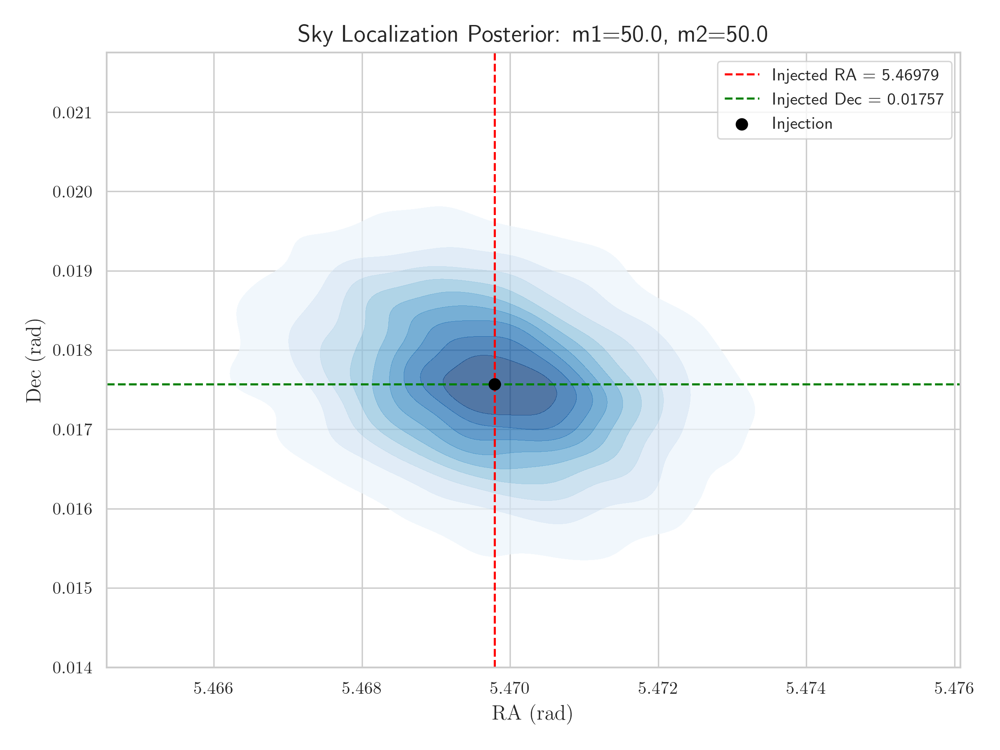
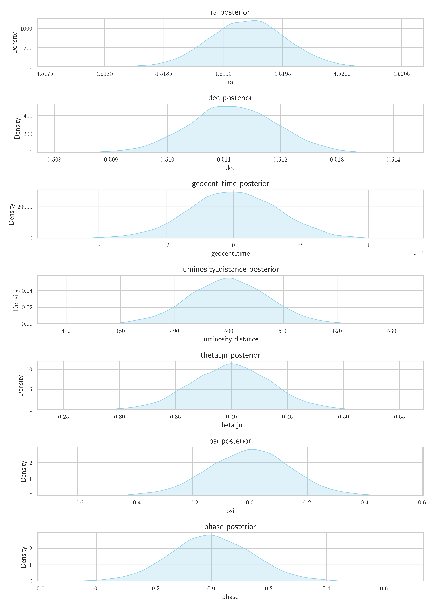
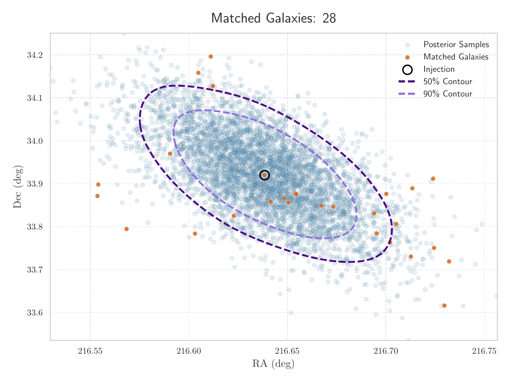

# EC Network Simulation Plots

[⬅️ Back to Home](index.md)

---

<strong>1000mpc</strong>

  

  
<strong>m1_10.0_m2_10.0</strong>

<embed src="plots/EC/1000mpc/m1_10.0_m2_10.0/2dcrossmatch.pdf" width="100%" height="600px" type="application/pdf" style="margin-bottom: 20px; border: 1px solid #ccc;" />

<embed src="plots/EC/1000mpc/m1_10.0_m2_10.0/3dcrossmatch.pdf" width="100%" height="600px" type="application/pdf" style="margin-bottom: 20px; border: 1px solid #ccc;" />

<embed src="plots/EC/1000mpc/m1_10.0_m2_10.0/skymap.pdf" width="100%" height="600px" type="application/pdf" style="margin-bottom: 20px; border: 1px solid #ccc;" />

  

  

  
<strong>m1_20.0_m2_20.0</strong>

<embed src="plots/EC/1000mpc/m1_20.0_m2_20.0/2dcrossmatch.pdf" width="100%" height="600px" type="application/pdf" style="margin-bottom: 20px; border: 1px solid #ccc;" />

<embed src="plots/EC/1000mpc/m1_20.0_m2_20.0/3dcrossmatch.pdf" width="100%" height="600px" type="application/pdf" style="margin-bottom: 20px; border: 1px solid #ccc;" />

<embed src="plots/EC/1000mpc/m1_20.0_m2_20.0/skymap.pdf" width="100%" height="600px" type="application/pdf" style="margin-bottom: 20px; border: 1px solid #ccc;" />

  

  

  
<strong>m1_30.0_m2_30.0</strong>

<embed src="plots/EC/1000mpc/m1_30.0_m2_30.0/2dcrossmatch.pdf" width="100%" height="600px" type="application/pdf" style="margin-bottom: 20px; border: 1px solid #ccc;" />

<embed src="plots/EC/1000mpc/m1_30.0_m2_30.0/3dcrossmatch.pdf" width="100%" height="600px" type="application/pdf" style="margin-bottom: 20px; border: 1px solid #ccc;" />

<embed src="plots/EC/1000mpc/m1_30.0_m2_30.0/skymap.pdf" width="100%" height="600px" type="application/pdf" style="margin-bottom: 20px; border: 1px solid #ccc;" />

  

  

  
<strong>m1_40.0_m2_40.0</strong>

<embed src="plots/EC/1000mpc/m1_40.0_m2_40.0/2dcrossmatch.pdf" width="100%" height="600px" type="application/pdf" style="margin-bottom: 20px; border: 1px solid #ccc;" />

<embed src="plots/EC/1000mpc/m1_40.0_m2_40.0/3dcrossmatch.pdf" width="100%" height="600px" type="application/pdf" style="margin-bottom: 20px; border: 1px solid #ccc;" />

<embed src="plots/EC/1000mpc/m1_40.0_m2_40.0/skymap.pdf" width="100%" height="600px" type="application/pdf" style="margin-bottom: 20px; border: 1px solid #ccc;" />

  

  

  
<strong>m1_5.0_m2_5.0</strong>

<embed src="plots/EC/1000mpc/m1_5.0_m2_5.0/2dcrossmatch.pdf" width="100%" height="600px" type="application/pdf" style="margin-bottom: 20px; border: 1px solid #ccc;" />

<embed src="plots/EC/1000mpc/m1_5.0_m2_5.0/3dcrossmatch.pdf" width="100%" height="600px" type="application/pdf" style="margin-bottom: 20px; border: 1px solid #ccc;" />

<embed src="plots/EC/1000mpc/m1_5.0_m2_5.0/skymap.pdf" width="100%" height="600px" type="application/pdf" style="margin-bottom: 20px; border: 1px solid #ccc;" />

  

  

  
<strong>m1_50.0_m2_50.0</strong>

<embed src="plots/EC/1000mpc/m1_50.0_m2_50.0/2dcrossmatch.pdf" width="100%" height="600px" type="application/pdf" style="margin-bottom: 20px; border: 1px solid #ccc;" />

<embed src="plots/EC/1000mpc/m1_50.0_m2_50.0/3dcrossmatch.pdf" width="100%" height="600px" type="application/pdf" style="margin-bottom: 20px; border: 1px solid #ccc;" />

<embed src="plots/EC/1000mpc/m1_50.0_m2_50.0/skymap.pdf" width="100%" height="600px" type="application/pdf" style="margin-bottom: 20px; border: 1px solid #ccc;" />

  

<strong>500mpc</strong>

  

  
<strong>m1_10.0_m2_10.0</strong>

<embed src="plots/EC/500mpc/m1_10.0_m2_10.0/2dcrossmatch.pdf" width="100%" height="600px" type="application/pdf" style="margin-bottom: 20px; border: 1px solid #ccc;" />

<embed src="plots/EC/500mpc/m1_10.0_m2_10.0/3dcrossmatch.pdf" width="100%" height="600px" type="application/pdf" style="margin-bottom: 20px; border: 1px solid #ccc;" />

<embed src="plots/EC/500mpc/m1_10.0_m2_10.0/skymap.pdf" width="100%" height="600px" type="application/pdf" style="margin-bottom: 20px; border: 1px solid #ccc;" />

  

  

  
<strong>m1_20.0_m2_20.0</strong>

<embed src="plots/EC/500mpc/m1_20.0_m2_20.0/2dcrossmatch.pdf" width="100%" height="600px" type="application/pdf" style="margin-bottom: 20px; border: 1px solid #ccc;" />

<embed src="plots/EC/500mpc/m1_20.0_m2_20.0/3dcrossmatch.pdf" width="100%" height="600px" type="application/pdf" style="margin-bottom: 20px; border: 1px solid #ccc;" />

<embed src="plots/EC/500mpc/m1_20.0_m2_20.0/skymap.pdf" width="100%" height="600px" type="application/pdf" style="margin-bottom: 20px; border: 1px solid #ccc;" />

  

  

  
<strong>m1_30.0_m2_30.0</strong>

<embed src="plots/EC/500mpc/m1_30.0_m2_30.0/2dcrossmatch.pdf" width="100%" height="600px" type="application/pdf" style="margin-bottom: 20px; border: 1px solid #ccc;" />

<embed src="plots/EC/500mpc/m1_30.0_m2_30.0/3dcrossmatch.pdf" width="100%" height="600px" type="application/pdf" style="margin-bottom: 20px; border: 1px solid #ccc;" />

<embed src="plots/EC/500mpc/m1_30.0_m2_30.0/skymap.pdf" width="100%" height="600px" type="application/pdf" style="margin-bottom: 20px; border: 1px solid #ccc;" />

  

  

  
<strong>m1_40.0_m2_40.0</strong>

<embed src="plots/EC/500mpc/m1_40.0_m2_40.0/2dcrossmatch.pdf" width="100%" height="600px" type="application/pdf" style="margin-bottom: 20px; border: 1px solid #ccc;" />

<embed src="plots/EC/500mpc/m1_40.0_m2_40.0/3dcrossmatch.pdf" width="100%" height="600px" type="application/pdf" style="margin-bottom: 20px; border: 1px solid #ccc;" />

<embed src="plots/EC/500mpc/m1_40.0_m2_40.0/skymap.pdf" width="100%" height="600px" type="application/pdf" style="margin-bottom: 20px; border: 1px solid #ccc;" />

  

  

  
<strong>m1_5.0_m2_5.0</strong>

<embed src="plots/EC/500mpc/m1_5.0_m2_5.0/2dcrossmatch.pdf" width="100%" height="600px" type="application/pdf" style="margin-bottom: 20px; border: 1px solid #ccc;" />

<embed src="plots/EC/500mpc/m1_5.0_m2_5.0/3dcrossmatch.pdf" width="100%" height="600px" type="application/pdf" style="margin-bottom: 20px; border: 1px solid #ccc;" />

<embed src="plots/EC/500mpc/m1_5.0_m2_5.0/skymap.pdf" width="100%" height="600px" type="application/pdf" style="margin-bottom: 20px; border: 1px solid #ccc;" />

  

  

  
<strong>m1_50.0_m2_50.0</strong>

<embed src="plots/EC/500mpc/m1_50.0_m2_50.0/2dcrossmatch.pdf" width="100%" height="600px" type="application/pdf" style="margin-bottom: 20px; border: 1px solid #ccc;" />

<embed src="plots/EC/500mpc/m1_50.0_m2_50.0/3dcrossmatch.pdf" width="100%" height="600px" type="application/pdf" style="margin-bottom: 20px; border: 1px solid #ccc;" />

<embed src="plots/EC/500mpc/m1_50.0_m2_50.0/skymap.pdf" width="100%" height="600px" type="application/pdf" style="margin-bottom: 20px; border: 1px solid #ccc;" />

  

<strong>750mpc</strong>

  

  
<strong>m1_10.0_m2_10.0</strong>

<embed src="plots/EC/750mpc/m1_10.0_m2_10.0/2dcrossmatch.pdf" width="100%" height="600px" type="application/pdf" style="margin-bottom: 20px; border: 1px solid #ccc;" />

<embed src="plots/EC/750mpc/m1_10.0_m2_10.0/3dcrossmatch.pdf" width="100%" height="600px" type="application/pdf" style="margin-bottom: 20px; border: 1px solid #ccc;" />

<embed src="plots/EC/750mpc/m1_10.0_m2_10.0/skymap.pdf" width="100%" height="600px" type="application/pdf" style="margin-bottom: 20px; border: 1px solid #ccc;" />

  

  

  
<strong>m1_20.0_m2_20.0</strong>

<embed src="plots/EC/750mpc/m1_20.0_m2_20.0/2dcrossmatch.pdf" width="100%" height="600px" type="application/pdf" style="margin-bottom: 20px; border: 1px solid #ccc;" />

<embed src="plots/EC/750mpc/m1_20.0_m2_20.0/3dcrossmatch.pdf" width="100%" height="600px" type="application/pdf" style="margin-bottom: 20px; border: 1px solid #ccc;" />

<embed src="plots/EC/750mpc/m1_20.0_m2_20.0/skymap.pdf" width="100%" height="600px" type="application/pdf" style="margin-bottom: 20px; border: 1px solid #ccc;" />

  

  

  
<strong>m1_30.0_m2_30.0</strong>

<embed src="plots/EC/750mpc/m1_30.0_m2_30.0/2dcrossmatch.pdf" width="100%" height="600px" type="application/pdf" style="margin-bottom: 20px; border: 1px solid #ccc;" />

<embed src="plots/EC/750mpc/m1_30.0_m2_30.0/3dcrossmatch.pdf" width="100%" height="600px" type="application/pdf" style="margin-bottom: 20px; border: 1px solid #ccc;" />

<embed src="plots/EC/750mpc/m1_30.0_m2_30.0/skymap.pdf" width="100%" height="600px" type="application/pdf" style="margin-bottom: 20px; border: 1px solid #ccc;" />

  

  

  
<strong>m1_40.0_m2_40.0</strong>

<embed src="plots/EC/750mpc/m1_40.0_m2_40.0/2dcrossmatch.pdf" width="100%" height="600px" type="application/pdf" style="margin-bottom: 20px; border: 1px solid #ccc;" />

<embed src="plots/EC/750mpc/m1_40.0_m2_40.0/3dcrossmatch.pdf" width="100%" height="600px" type="application/pdf" style="margin-bottom: 20px; border: 1px solid #ccc;" />

<embed src="plots/EC/750mpc/m1_40.0_m2_40.0/skymap.pdf" width="100%" height="600px" type="application/pdf" style="margin-bottom: 20px; border: 1px solid #ccc;" />

  

  

  
<strong>m1_5.0_m2_5.0</strong>

<embed src="plots/EC/750mpc/m1_5.0_m2_5.0/2dcrossmatch.pdf" width="100%" height="600px" type="application/pdf" style="margin-bottom: 20px; border: 1px solid #ccc;" />

<embed src="plots/EC/750mpc/m1_5.0_m2_5.0/3dcrossmatch.pdf" width="100%" height="600px" type="application/pdf" style="margin-bottom: 20px; border: 1px solid #ccc;" />

<embed src="plots/EC/750mpc/m1_5.0_m2_5.0/skymap.pdf" width="100%" height="600px" type="application/pdf" style="margin-bottom: 20px; border: 1px solid #ccc;" />

  

  

  
<strong>m1_50.0_m2_50.0</strong>

<embed src="plots/EC/750mpc/m1_50.0_m2_50.0/2dcrossmatch.pdf" width="100%" height="600px" type="application/pdf" style="margin-bottom: 20px; border: 1px solid #ccc;" />

<embed src="plots/EC/750mpc/m1_50.0_m2_50.0/3dcrossmatch.pdf" width="100%" height="600px" type="application/pdf" style="margin-bottom: 20px; border: 1px solid #ccc;" />

<embed src="plots/EC/750mpc/m1_50.0_m2_50.0/skymap.pdf" width="100%" height="600px" type="application/pdf" style="margin-bottom: 20px; border: 1px solid #ccc;" />

  

