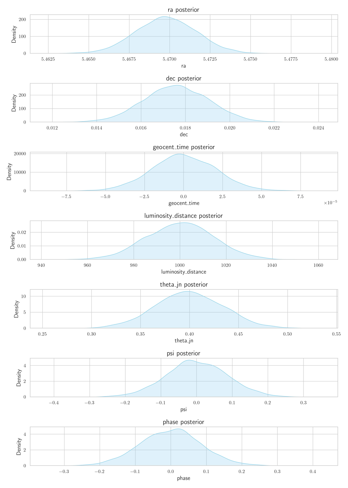

# HLVKIEC Network Simulation Plots

[⬅️ Back to Home](index.md)

---

<strong>1000mpc</strong>

  

  
<strong>10_10</strong>

<embed src="plots/HLVKIEC/1000mpc/10_10/2dcrossmatch.pdf" width="100%" height="600px" type="application/pdf" style="margin-bottom: 20px; border: 1px solid #ccc;" />

<embed src="plots/HLVKIEC/1000mpc/10_10/3dcrossmatch.pdf" width="100%" height="600px" type="application/pdf" style="margin-bottom: 20px; border: 1px solid #ccc;" />

<embed src="plots/HLVKIEC/1000mpc/10_10/hist.pdf" width="100%" height="600px" type="application/pdf" style="margin-bottom: 20px; border: 1px solid #ccc;" />

<embed src="plots/HLVKIEC/1000mpc/10_10/skymap.pdf" width="100%" height="600px" type="application/pdf" style="margin-bottom: 20px; border: 1px solid #ccc;" />

  

  

  
<strong>20_20</strong>

<embed src="plots/HLVKIEC/1000mpc/20_20/2dcrossmatch.pdf" width="100%" height="600px" type="application/pdf" style="margin-bottom: 20px; border: 1px solid #ccc;" />

<embed src="plots/HLVKIEC/1000mpc/20_20/3dcrossmatch.pdf" width="100%" height="600px" type="application/pdf" style="margin-bottom: 20px; border: 1px solid #ccc;" />

<embed src="plots/HLVKIEC/1000mpc/20_20/hist.pdf" width="100%" height="600px" type="application/pdf" style="margin-bottom: 20px; border: 1px solid #ccc;" />

<embed src="plots/HLVKIEC/1000mpc/20_20/skymap.pdf" width="100%" height="600px" type="application/pdf" style="margin-bottom: 20px; border: 1px solid #ccc;" />

  

  

  
<strong>30_30</strong>

<embed src="plots/HLVKIEC/1000mpc/30_30/2dcrossmatch.pdf" width="100%" height="600px" type="application/pdf" style="margin-bottom: 20px; border: 1px solid #ccc;" />

<embed src="plots/HLVKIEC/1000mpc/30_30/3dcrossmatch.pdf" width="100%" height="600px" type="application/pdf" style="margin-bottom: 20px; border: 1px solid #ccc;" />

<embed src="plots/HLVKIEC/1000mpc/30_30/hist.pdf" width="100%" height="600px" type="application/pdf" style="margin-bottom: 20px; border: 1px solid #ccc;" />

<embed src="plots/HLVKIEC/1000mpc/30_30/skymap.pdf" width="100%" height="600px" type="application/pdf" style="margin-bottom: 20px; border: 1px solid #ccc;" />

  

  

  
<strong>40_40</strong>

<embed src="plots/HLVKIEC/1000mpc/40_40/2dcrossmatch.pdf" width="100%" height="600px" type="application/pdf" style="margin-bottom: 20px; border: 1px solid #ccc;" />

<embed src="plots/HLVKIEC/1000mpc/40_40/3dcrossmatch.pdf" width="100%" height="600px" type="application/pdf" style="margin-bottom: 20px; border: 1px solid #ccc;" />

<embed src="plots/HLVKIEC/1000mpc/40_40/hist.pdf" width="100%" height="600px" type="application/pdf" style="margin-bottom: 20px; border: 1px solid #ccc;" />

<embed src="plots/HLVKIEC/1000mpc/40_40/skymap.pdf" width="100%" height="600px" type="application/pdf" style="margin-bottom: 20px; border: 1px solid #ccc;" />

  

  

  
<strong>50_50</strong>

<embed src="plots/HLVKIEC/1000mpc/50_50/2dcrossmatch.pdf" width="100%" height="600px" type="application/pdf" style="margin-bottom: 20px; border: 1px solid #ccc;" />

<embed src="plots/HLVKIEC/1000mpc/50_50/3dcrossmatch.pdf" width="100%" height="600px" type="application/pdf" style="margin-bottom: 20px; border: 1px solid #ccc;" />

<embed src="plots/HLVKIEC/1000mpc/50_50/hist.pdf" width="100%" height="600px" type="application/pdf" style="margin-bottom: 20px; border: 1px solid #ccc;" />

<embed src="plots/HLVKIEC/1000mpc/50_50/skymap.pdf" width="100%" height="600px" type="application/pdf" style="margin-bottom: 20px; border: 1px solid #ccc;" />

  

  

  
<strong>5_5</strong>

<embed src="plots/HLVKIEC/1000mpc/5_5/2dcrossmatch.pdf" width="100%" height="600px" type="application/pdf" style="margin-bottom: 20px; border: 1px solid #ccc;" />

<embed src="plots/HLVKIEC/1000mpc/5_5/3dcrossmatch.pdf" width="100%" height="600px" type="application/pdf" style="margin-bottom: 20px; border: 1px solid #ccc;" />

<embed src="plots/HLVKIEC/1000mpc/5_5/hist.pdf" width="100%" height="600px" type="application/pdf" style="margin-bottom: 20px; border: 1px solid #ccc;" />

<embed src="plots/HLVKIEC/1000mpc/5_5/skymap.pdf" width="100%" height="600px" type="application/pdf" style="margin-bottom: 20px; border: 1px solid #ccc;" />

  

<strong>500mpc</strong>

  

  
<strong>10_10</strong>

<embed src="plots/HLVKIEC/500mpc/10_10/2dcrossmatch.pdf" width="100%" height="600px" type="application/pdf" style="margin-bottom: 20px; border: 1px solid #ccc;" />

<embed src="plots/HLVKIEC/500mpc/10_10/3dcrossmatch.pdf" width="100%" height="600px" type="application/pdf" style="margin-bottom: 20px; border: 1px solid #ccc;" />

<embed src="plots/HLVKIEC/500mpc/10_10/skymap.pdf" width="100%" height="600px" type="application/pdf" style="margin-bottom: 20px; border: 1px solid #ccc;" />

  

  

  
<strong>20_20</strong>

<embed src="plots/HLVKIEC/500mpc/20_20/2dcrossmatch.pdf" width="100%" height="600px" type="application/pdf" style="margin-bottom: 20px; border: 1px solid #ccc;" />

<embed src="plots/HLVKIEC/500mpc/20_20/3dcrossmatch.pdf" width="100%" height="600px" type="application/pdf" style="margin-bottom: 20px; border: 1px solid #ccc;" />

<embed src="plots/HLVKIEC/500mpc/20_20/skymap.pdf" width="100%" height="600px" type="application/pdf" style="margin-bottom: 20px; border: 1px solid #ccc;" />

  

  

  
<strong>30_30</strong>

<embed src="plots/HLVKIEC/500mpc/30_30/2dcrossmatch.pdf" width="100%" height="600px" type="application/pdf" style="margin-bottom: 20px; border: 1px solid #ccc;" />

<embed src="plots/HLVKIEC/500mpc/30_30/3dcrossmatch.pdf" width="100%" height="600px" type="application/pdf" style="margin-bottom: 20px; border: 1px solid #ccc;" />

<embed src="plots/HLVKIEC/500mpc/30_30/skymap.pdf" width="100%" height="600px" type="application/pdf" style="margin-bottom: 20px; border: 1px solid #ccc;" />

  

  

  
<strong>40_40</strong>

<embed src="plots/HLVKIEC/500mpc/40_40/2dcrossmatch.pdf" width="100%" height="600px" type="application/pdf" style="margin-bottom: 20px; border: 1px solid #ccc;" />

<embed src="plots/HLVKIEC/500mpc/40_40/3dcrossmatch.pdf" width="100%" height="600px" type="application/pdf" style="margin-bottom: 20px; border: 1px solid #ccc;" />

<embed src="plots/HLVKIEC/500mpc/40_40/skymap.pdf" width="100%" height="600px" type="application/pdf" style="margin-bottom: 20px; border: 1px solid #ccc;" />

  

  

  
<strong>50_50</strong>

<embed src="plots/HLVKIEC/500mpc/50_50/2dcrossmatch.pdf" width="100%" height="600px" type="application/pdf" style="margin-bottom: 20px; border: 1px solid #ccc;" />

<embed src="plots/HLVKIEC/500mpc/50_50/3dcrossmatch.pdf" width="100%" height="600px" type="application/pdf" style="margin-bottom: 20px; border: 1px solid #ccc;" />

<embed src="plots/HLVKIEC/500mpc/50_50/skymap.pdf" width="100%" height="600px" type="application/pdf" style="margin-bottom: 20px; border: 1px solid #ccc;" />

  

  

  
<strong>5_5</strong>

<embed src="plots/HLVKIEC/500mpc/5_5/2dcrossmatch.pdf" width="100%" height="600px" type="application/pdf" style="margin-bottom: 20px; border: 1px solid #ccc;" />

<embed src="plots/HLVKIEC/500mpc/5_5/3dcrossmatch.pdf" width="100%" height="600px" type="application/pdf" style="margin-bottom: 20px; border: 1px solid #ccc;" />

<embed src="plots/HLVKIEC/500mpc/5_5/skymap.pdf" width="100%" height="600px" type="application/pdf" style="margin-bottom: 20px; border: 1px solid #ccc;" />

  

<strong>750mpc</strong>

  

  
<strong>10_10</strong>

<embed src="plots/HLVKIEC/750mpc/10_10/2dcrossmatch.pdf" width="100%" height="600px" type="application/pdf" style="margin-bottom: 20px; border: 1px solid #ccc;" />

<embed src="plots/HLVKIEC/750mpc/10_10/3dcrossmatch.pdf" width="100%" height="600px" type="application/pdf" style="margin-bottom: 20px; border: 1px solid #ccc;" />

<embed src="plots/HLVKIEC/750mpc/10_10/hist.pdf" width="100%" height="600px" type="application/pdf" style="margin-bottom: 20px; border: 1px solid #ccc;" />

<embed src="plots/HLVKIEC/750mpc/10_10/skymap.pdf" width="100%" height="600px" type="application/pdf" style="margin-bottom: 20px; border: 1px solid #ccc;" />

  

  

  
<strong>20_20</strong>

<embed src="plots/HLVKIEC/750mpc/20_20/2dcrossmatch.pdf" width="100%" height="600px" type="application/pdf" style="margin-bottom: 20px; border: 1px solid #ccc;" />

<embed src="plots/HLVKIEC/750mpc/20_20/3dcrossmatch.pdf" width="100%" height="600px" type="application/pdf" style="margin-bottom: 20px; border: 1px solid #ccc;" />

<embed src="plots/HLVKIEC/750mpc/20_20/hist.pdf" width="100%" height="600px" type="application/pdf" style="margin-bottom: 20px; border: 1px solid #ccc;" />

<embed src="plots/HLVKIEC/750mpc/20_20/skymap.pdf" width="100%" height="600px" type="application/pdf" style="margin-bottom: 20px; border: 1px solid #ccc;" />

  

  

  
<strong>30_30</strong>

<embed src="plots/HLVKIEC/750mpc/30_30/2dcrossmatch.pdf" width="100%" height="600px" type="application/pdf" style="margin-bottom: 20px; border: 1px solid #ccc;" />

<embed src="plots/HLVKIEC/750mpc/30_30/3dcrossmatch.pdf" width="100%" height="600px" type="application/pdf" style="margin-bottom: 20px; border: 1px solid #ccc;" />

<embed src="plots/HLVKIEC/750mpc/30_30/hist.pdf" width="100%" height="600px" type="application/pdf" style="margin-bottom: 20px; border: 1px solid #ccc;" />

<embed src="plots/HLVKIEC/750mpc/30_30/skymap.pdf" width="100%" height="600px" type="application/pdf" style="margin-bottom: 20px; border: 1px solid #ccc;" />

  

  

  
<strong>40_40</strong>

<embed src="plots/HLVKIEC/750mpc/40_40/2dcrossmatch.pdf" width="100%" height="600px" type="application/pdf" style="margin-bottom: 20px; border: 1px solid #ccc;" />

<embed src="plots/HLVKIEC/750mpc/40_40/3dcrossmatch.pdf" width="100%" height="600px" type="application/pdf" style="margin-bottom: 20px; border: 1px solid #ccc;" />

<embed src="plots/HLVKIEC/750mpc/40_40/hist.pdf" width="100%" height="600px" type="application/pdf" style="margin-bottom: 20px; border: 1px solid #ccc;" />

<embed src="plots/HLVKIEC/750mpc/40_40/skymap.pdf" width="100%" height="600px" type="application/pdf" style="margin-bottom: 20px; border: 1px solid #ccc;" />

  

  

  
<strong>50_50</strong>

<embed src="plots/HLVKIEC/750mpc/50_50/2dcrossmatch.pdf" width="100%" height="600px" type="application/pdf" style="margin-bottom: 20px; border: 1px solid #ccc;" />

<embed src="plots/HLVKIEC/750mpc/50_50/3dcrossmatch.pdf" width="100%" height="600px" type="application/pdf" style="margin-bottom: 20px; border: 1px solid #ccc;" />

<embed src="plots/HLVKIEC/750mpc/50_50/hist.pdf" width="100%" height="600px" type="application/pdf" style="margin-bottom: 20px; border: 1px solid #ccc;" />

<embed src="plots/HLVKIEC/750mpc/50_50/skymap.pdf" width="100%" height="600px" type="application/pdf" style="margin-bottom: 20px; border: 1px solid #ccc;" />

  

  

  
<strong>5_5</strong>

<embed src="plots/HLVKIEC/750mpc/5_5/2dcrossmatch.pdf" width="100%" height="600px" type="application/pdf" style="margin-bottom: 20px; border: 1px solid #ccc;" />

<embed src="plots/HLVKIEC/750mpc/5_5/3dcrossmatch.pdf" width="100%" height="600px" type="application/pdf" style="margin-bottom: 20px; border: 1px solid #ccc;" />

<embed src="plots/HLVKIEC/750mpc/5_5/hist.pdf" width="100%" height="600px" type="application/pdf" style="margin-bottom: 20px; border: 1px solid #ccc;" />

<embed src="plots/HLVKIEC/750mpc/5_5/skymap.pdf" width="100%" height="600px" type="application/pdf" style="margin-bottom: 20px; border: 1px solid #ccc;" />

  

