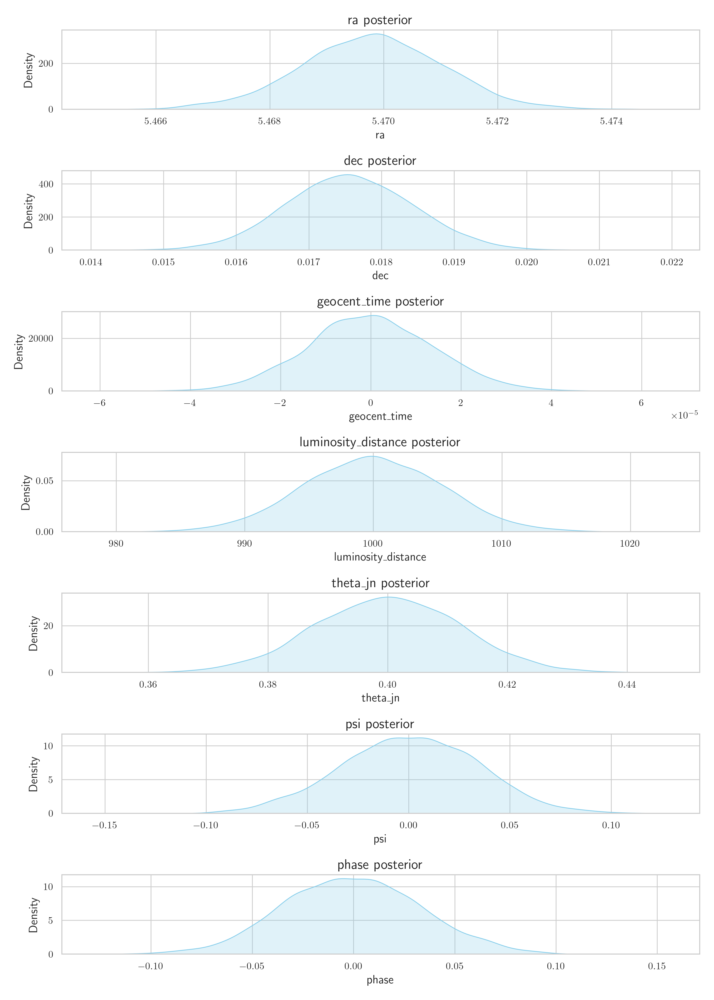
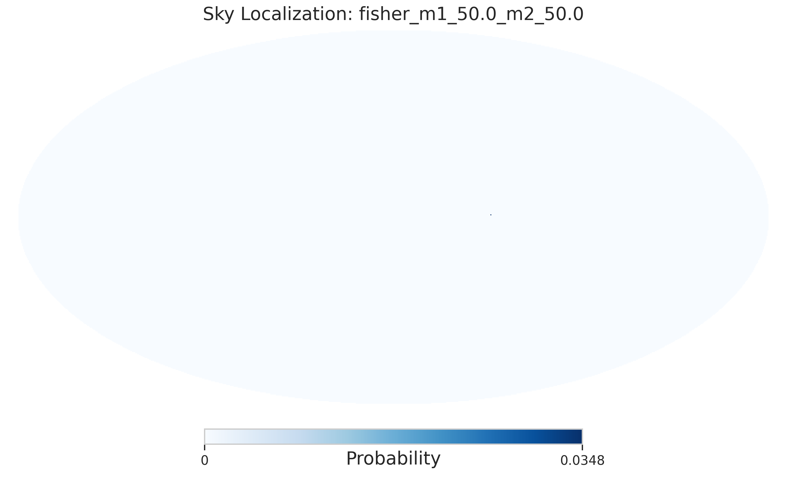

# BBH Simulation Plots

## Navigation
- [HLVKIEC/1000mpc](#hlvkiec-1000mpc)
- [HLVKIEC/1000mpc/50_50](#hlvkiec-1000mpc-50_50)
- [network_comparison](#network_comparison)

<strong>HLVKIEC/1000mpc</strong>

<strong>HLVKIEC/1000mpc/50_50</strong>

<strong>network_comparison</strong>

